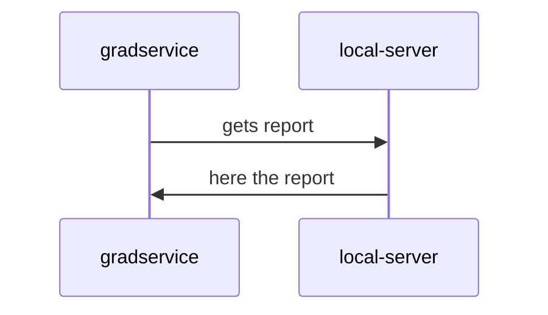
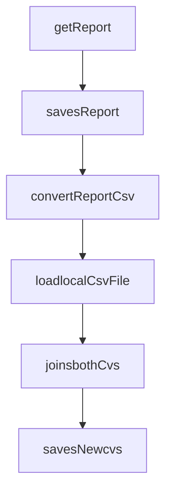

Grad project, 

Create folder that contains your name,
start the project from that foldeer 

you will need to create a application 
that calls a GET endpoint  "ipAdress:8080/api/v1Report"  
this will return list of Data 
this can be Done either using chrome or postman 

you need to add this list of data to the input csv file that you have been given, 

merge these to data together and save it as a new csv file, 

please use the result.csv file as a example of the new file layout 

## UML diagrams

## Flow diagrams
